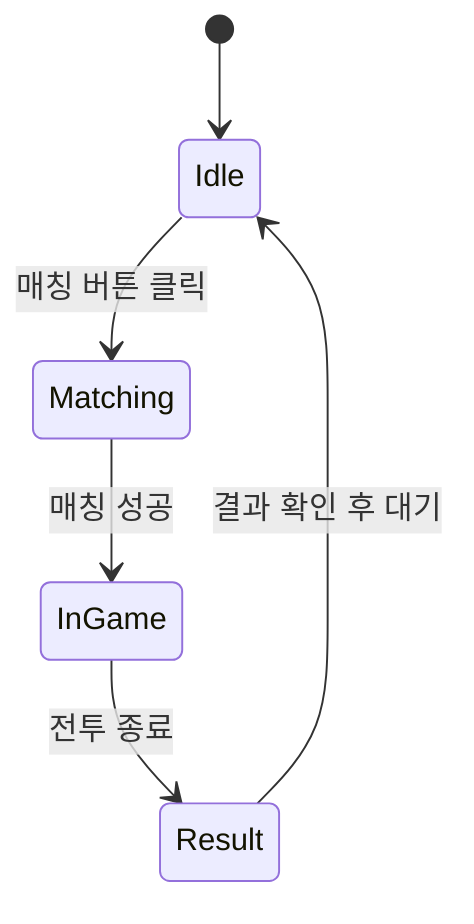
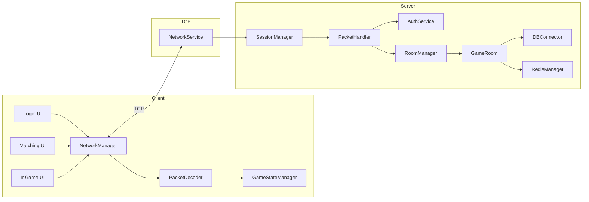

# 🎮 DuelCore: Real-time 1v1 PvP Game Server Portfolio
> 🚀 Game Title: **ONEvONE**  
> 🛠️ Tech Stack: C++ 서버 + Unity 클라이언트  
> 🎯 포지션: 게임 서버 개발 포트폴리오  
> 🎓 목적: 국내 게임사 신입 서버 개발자 포지션 지원

---

## 📌 프로젝트 개요

**DuelCore**는 1:1 실시간 PvP 탑다운 슈팅 게임 **ONEvONE**의 서버/클라이언트 구조를 구현한 기술 포트폴리오입니다.  
IOCP 기반 고성능 C++ 서버와 Unity 클라이언트 간 TCP 통신을 통해, 매칭 → 전투 → 결과 저장까지의 실시간 흐름을 구현하였습니다.

---

## 🧰 기술 스택 요약

### 🖥️ 서버 (C++17)

- **네트워크**: IOCP 기반 비동기 통신
- **직렬화**: FlatBuffers
- **DB/캐시**: MySQL, Redis
- **멀티스레딩**: 스레드풀 구조
- **인증**: JWT (토큰 발급 및 검증)
- **로깅**: spdlog
- **빌드**: MSBuild + vcpkg

### 🎮 클라이언트 (Unity C#)

- **엔진**: Unity 2022 LTS
- **통신**: TcpClient 기반 비동기 송수신
- **동기화**: 서버 권한 기준 위치/공격 상태 처리
- **UI/UX**: 로그인 → 매칭 → 전투 → 결과 흐름
- **상태 관리**: FSM 기반 씬 전환 구조

---

## 📚 문서 목차

- [핵심 기능 요구사항](#-핵심-기능-요구사항-정리)
- [서버 구조 설계](#-서버-구조-설계)
- [유저 상태 흐름 FSM](#-유저-상태-흐름-fsm)
- [클라이언트 구조 설계](#-클라이언트-구조-설계)
- [클라이언트-서버 인터페이스](#-클라이언트-서버-인터페이스-예시)
- [서버 폴더 구조](#-폴더-구조-초안-서버)
- [전체 아키텍처 다이어그램](#️-전체-아키텍처-다이어그램-mermaid)

---

# ✅ 요구사항 정리 및 구조 설계

## 📌 핵심 기능 요구사항 정리

### 1. 로그인 및 인증

- 유저 로그인 API 제공
- JWT 기반 인증 토큰 발급 및 검증
- MySQL 유저 정보 저장 및 검증

### 2. 매칭 시스템

- 1:1 실시간 PvP 매칭
- Redis 기반 대기열 큐 구성
- 매칭 성공 시 룸 배정

### 3. 전투 시스템

- 실시간 위치/공격 동기화
- 서버 권한 기반 상태 판정
- 전투 종료 조건 및 승패 판단

### 4. 결과 저장

- 승패 결과 MySQL 저장
- 유저 기록 갱신

### 5. 클라이언트 흐름

- 로그인 → 매칭 → 전투 → 결과 → 재매칭

---

## 🧩 서버 구조 설계

### 🧱 주요 컴포넌트

| 컴포넌트 | 설명 |
| --- | --- |
| `NetworkService` | IOCP 기반 비동기 소켓 수신 처리 |
| `SessionManager` | 클라이언트 세션 관리 (연결/해제/전송) |
| `PacketHandler` | 패킷 파싱 및 처리 함수 매핑 |
| `GameRoom` | 전투 FSM 처리, 유저 동기화 |
| `RoomManager` | 룸 객체 풀 및 룸 배정 관리 |
| `RedisManager` | 매칭 큐 대기열 처리 |
| `DBConnector` | MySQL 연결 및 쿼리 처리 |
| `AuthService` | JWT 발급 및 인증 검증 |

---

### 🔁 유저 상태 흐름 FSM



---

## 🎮 클라이언트 구조 설계

| 컴포넌트 | 설명 |
| --- | --- |
| `NetworkManager` | TCPClient 연결 및 송수신 처리 |
| `PacketDecoder` | 서버 패킷 파싱 |
| `GameStateManager` | 상태 FSM 관리 |
| `PlayerController` | 입력 처리 및 상태 업데이트 |
| `UIManager` | 로그인/매칭/결과 UI 관리 |

---

## 🔗 클라이언트-서버 인터페이스 예시

| 기능 | 요청 | 응답 |
| --- | --- | --- |
| 로그인 | `CS_LOGIN_REQ` (id, pw) | `SC_LOGIN_RES` (jwt token) |
| 매칭 요청 | `CS_MATCH_REQ` | `SC_MATCH_OK` (room id) |
| 위치/공격 | `CS_MOVE/ATTACK` | `SC_BROADCAST_MOVE/ATTACK` |
| 게임 종료 | 없음 | `SC_RESULT` (승/패, 기록) |

---

## 📂 폴더 구조 초안 (서버)

```
/Server
├── Core/                # IOCP 네트워크 처리, 스레드 풀 등 서버 코어 로직
├── Session/             # Session 및 SessionManager 클래스
├── Room/                # GameRoom 및 RoomManager
├── Packet/              # 패킷 핸들러, 패킷 타입, 직렬화 정의
├── DB/                  # MySQL 연동을 위한 DBConnector, 쿼리 처리
├── Redis/               # Redis 연동 모듈
├── Auth/                # JWT 토큰 발급/검증 로직
├── FlatBuffers/         # .fbs 스키마 파일 및 빌드 스크립트
├── main.cpp             # 서버 진입점
└── Server.vcxproj       # Visual Studio 프로젝트 파일
```

---

## 🗂️ 전체 아키텍처 다이어그램 (Mermaid)


